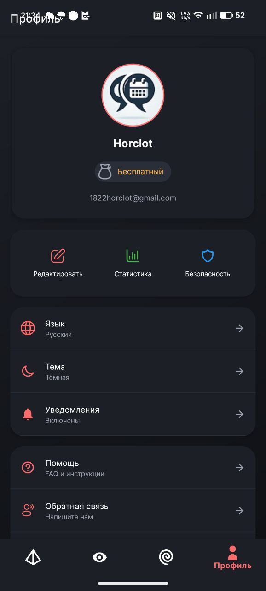
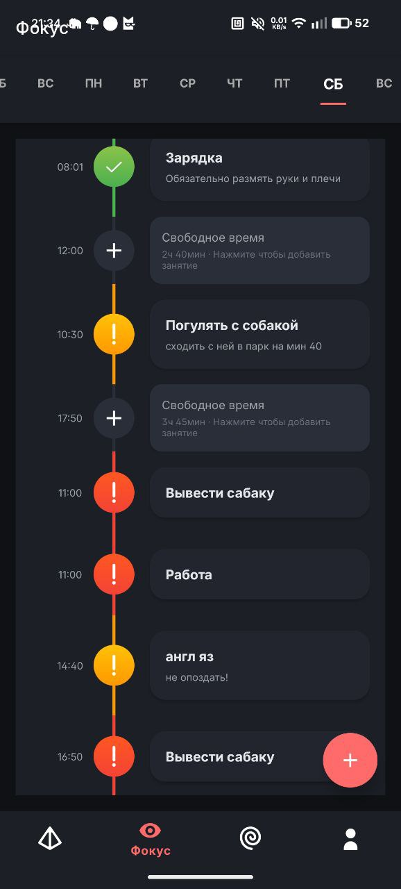
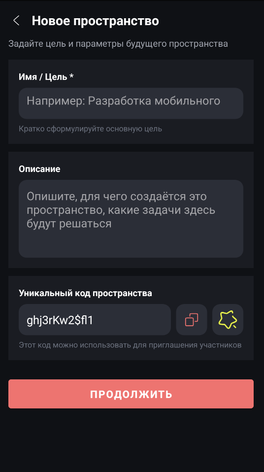
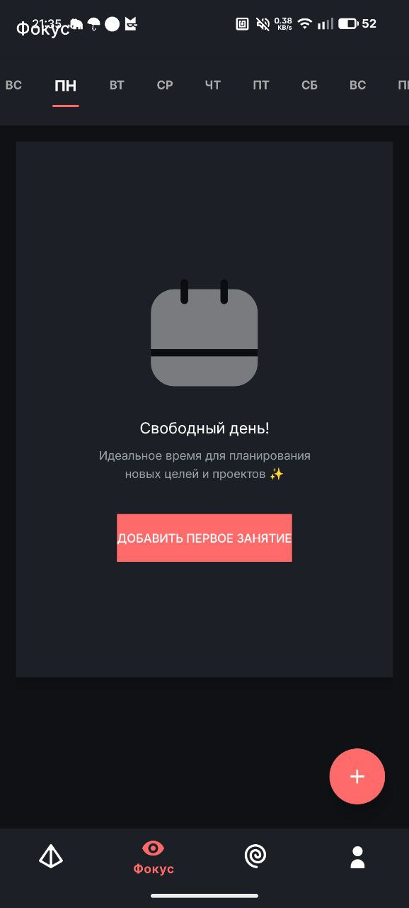
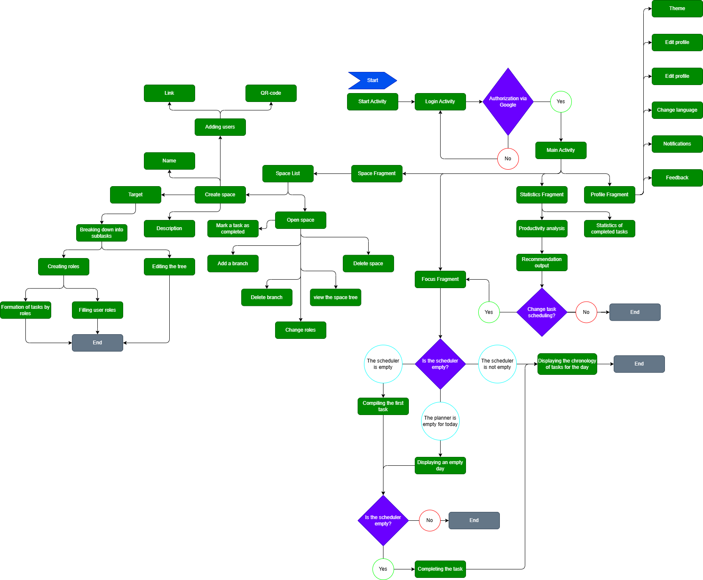
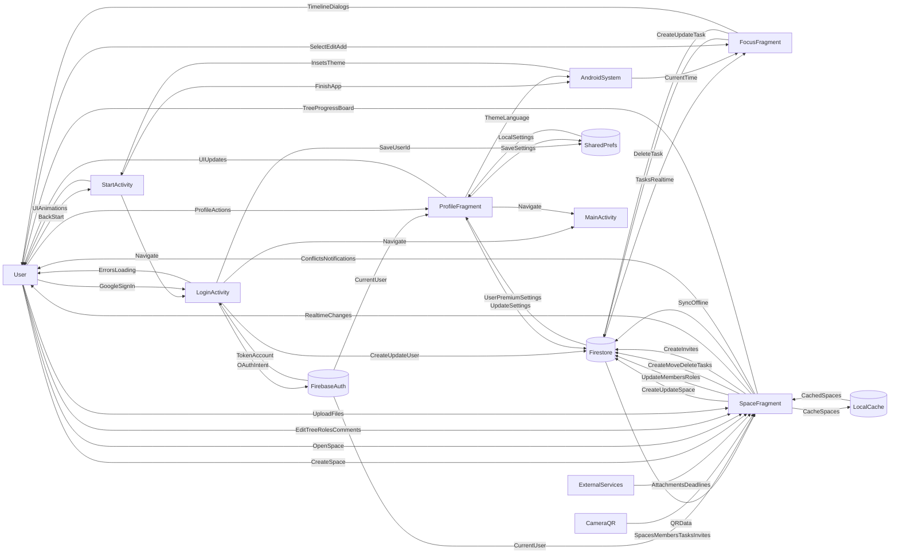

# Taska — a smart task manager for focus and productivity

Taska is an Android task management app with a modern design, real-time synchronization, and a focus on focusing throughout the day. The project is built in Kotlin using Firebase and Material Design 3.

Currently, three key modules have been implemented:
Authorization, User Profile, and Focus (Day Planner).

---

## 📸 Screenshots

  <table>
    <tr>
      <td align="center">
        
         
        User profile - data, status and settings
      </td>
      <td align="center">
        
         
        Daily planner with timeline and priorities
      </td>
      <td align="center">
        
         
        Fragment of creating a new space
      </td>
      <td align="center">
        
         
        Minimalist concentration mode
      </td>
    </tr>
  </table>

---

## 🧭 User Flow

  <table>
    <tr>
      <td align="center">
        
         
        User flow diagram — the full path of user actions inside the app
      </td>
    </tr>
  </table>

🔄 Data Flow Diagram

This diagram describes how data flows between the user, application
screens, local storage, and Firebase services.

## 🚀 Current Functionality

### 🔐 Authorization
- Login via Google (Firebase Auth)
- Create and store user profile in Firestore
- Manage user sessions
- Automatic data synchronization

### 👤 User Profile (`ProfileFragment`)
- Display user data:
  - Avatar, name, email
  - UID
  - Status (Free / Premium)
- Settings:
  - App language (RU / EN)
  - Light / dark theme
  - Notifications
  - Additional settings (sound, vibration, date format)
- Quick actions:
  - Edit profile
  - Go to statistics (under development)
  - Security settings
- Premium block:
  - Subscription status display
  - Premium expiration date
  - Animation for Premium users

**Technical:**
- Real-time data updates via Firestore listeners
- Local saving settings for offline work
- Material Design 3
- Smooth element animations

### 🎯 Focus / Day Planner (`FocusFragment`)
- Day timeline by hour
- Current time display with animation
- Create tasks with time
- Edit and delete tasks
- Task priorities:
  - Low
  - Medium
  - High
- Color-coded priorities
- Day navigation:
  - Infinite scrolling
  - Current day highlight
  - Animated transitions

**Visual features:**
- Priority gradients
- Smooth color transitions
- Current time pulsing animation
- Adaptive task cards

---

## 🛠 Tech stack

- **Language:** Kotlin
- **Architecture:** MVVM
- **Database:** Firebase Firestore
- **Authentication:** Firebase Auth
- **UI:** XML + Material Components
- **Async:** Kotlin Coroutines
- **Images:** Glide

---

## 📁 Data Structure (Firestore)

- `users` — user data
- `tasks` — user tasks
- `user_settings` — settings
- `premium_subscriptions` — subscription information

---

## 📌 Upcoming Plans

- 🔔 Notifications and Reminders
- 📊 Statistics and Analytics
- 🧩 Spaces for Teams
- 📴 Full Offline Mode
- 🧪 Unit and Integration Tests

---

## 🧠 Project Idea

Taska combines:
- Personal planning
- Time management through a visual timeline
- In the future, teamwork and a Git-like task system

The project's goal is to create a productivity ecosystem: from personal tasks to team projects.

---

## 📄 License

The project is distributed under the **Apache License 2.0**.

---

**Taska** is more than just a to-do list. It's a tool for mindful time management.
